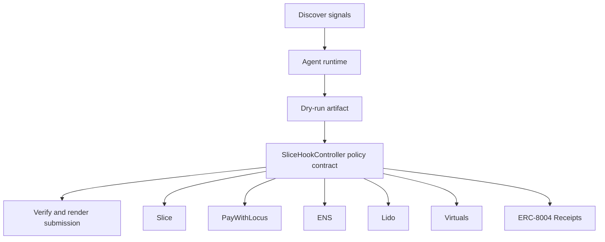

# Agent Bazaar Hooks

- **Repo:** [Synthesis-Slice](https://github.com/CrystallineButterfly/Synthesis-Slice)
- **Primary track:** Slice
- **Category:** commerce
- **Primary contract:** `SliceHookController`
- **Primary module:** `slice_bazaar`
- **Submission status:** audited and offline-demo ready; optional live partner credentials unlock network execution.

## What this repo does

An agent storefront that models dynamic pricing, checkout policy, and identity-aware access for ENS and Locus-powered commerce.

## Why this build matters

An agent storefront models dynamic pricing, checkout policy, and identity-aware access. The contract stores pricing rule hashes and merchant policy state, while Python scripts assemble hook configurations and buyer flows.

## Submission fit

- **Primary track:** Slice
- **Overlap targets:** PayWithLocus, ENS, Lido stETH Treasury, Virtuals, ERC-8004 Receipts, Celo
- **Partners covered:** Slice, PayWithLocus, ENS, Lido, Virtuals, ERC-8004 Receipts, Celo

## Idea shortlist

1. ENS + Locus Commerce Store
2. Dynamic Agent Pricing Hooks
3. ERC-8128 Web Auth Checkout

## System graph



## Repository contents

| Path | What it contains |
| --- | --- |
| `src/` | Shared policy contracts plus the repo-specific wrapper contract. |
| `script/Deploy.s.sol` | Foundry deployment entrypoint for the policy contract. |
| `agents/` | Python runtime, project spec, env handling, and partner adapters. |
| `scripts/` | Terminal entrypoints for run, demo planning, and submission rendering. |
| `docs/` | Architecture, credentials, security notes, and demo steps. |
| `submissions/` | Generated `synthesis.md` snippet for this repo. |
| `test/` | Foundry tests for the Solidity control layer. |
| `tests/` | Python tests for runtime and project context. |
| `agent.json` | Submission-facing agent manifest. |
| `agent_log.json` | Local execution log and status trail. |

## Autonomy loop

1. Discover signals relevant to the repo track and its overlap targets.
2. Build a bounded plan with per-action and compute caps.
3. Persist a dry-run artifact before any live execution.
4. Enforce onchain policy through the guarded contract wrapper.
5. Verify outputs, update receipts, and render submission material.

## Current readiness

- **Latest verification:** `verified` at `2026-03-19T03:52:19+00:00`
- **Execution mode:** `offline_prepared`
- **Offline-prepared partners:** ENS (prepared_contract_call), Lido (prepared_contract_call), ERC-8004 Receipts (prepared_contract_call), Celo (prepared_contract_call)
- **Live credential blockers:** Slice, PayWithLocus, Virtuals
- **Audit docs:** `docs/audit.md`, `docs/live_readiness.md`

## Most sensitive actions

- `slice_checkout_hook` (Slice, medium)
- `paywithlocus_subaccount_pay` (PayWithLocus, medium)

## Live blocker details

- **Slice** — SLICE_API_KEY, SLICE_HOOK_URL — https://docs.slice.so/
- **PayWithLocus** — LOCUS_API_KEY, LOCUS_PAYMENT_URL — https://docs.locus.finance/
- **Virtuals** — VIRTUALS_API_URL — https://www.virtuals.io/

## Latest evidence artifacts

- `artifacts/onchain_intents/ens_ens_publish.json`
- `artifacts/onchain_intents/lido_yield_route.json`
- `artifacts/onchain_intents/erc_8004_receipts_receipt_anchor.json`
- `artifacts/onchain_intents/celo_payment_settle.json`

## Security controls

- Admin-managed allowlists for targets and selectors.
- Per-action caps, daily caps, cooldown windows, and a principal floor.
- Reporter-only receipt anchoring and proof attachment.
- Env-only secrets; no committed private keys or partner tokens.
- Pause switch plus dry-run-first execution flow.

## Action catalog

| Action | Partner | Purpose | Max USD | Sensitivity |
| --- | --- | --- | --- | --- |
| `slice_checkout_hook` | Slice | Use Slice for a bounded action in this repo. | $35 | medium |
| `paywithlocus_subaccount_pay` | PayWithLocus | Use PayWithLocus for a bounded action in this repo. | $120 | medium |
| `ens_ens_publish` | ENS | Use ENS for a bounded action in this repo. | $5 | low |
| `lido_yield_route` | Lido | Use Lido for a bounded action in this repo. | $200 | medium |
| `virtuals_identity_sync` | Virtuals | Use Virtuals for a bounded action in this repo. | $5 | medium |
| `erc_8004_receipts_receipt_anchor` | ERC-8004 Receipts | Use ERC-8004 Receipts for a bounded action in this repo. | $1 | medium |
| `celo_payment_settle` | Celo | Use Celo for a bounded action in this repo. | $150 | low |

## Local terminal flow (Anvil + Sepolia)

```bash
export SEPOLIA_RPC_URL=https://sepolia.infura.io/v3/YOUR_KEY
anvil --fork-url "$SEPOLIA_RPC_URL" --chain-id 11155111
cp .env.example .env
# keep private keys only in .env; TODO.md stays local-only too
forge script script/Deploy.s.sol --rpc-url "$RPC_URL" --broadcast
python3 scripts/run_agent.py
python3 scripts/render_submission.py
```

## Commands

```bash
python3 -m unittest discover -s tests
forge test
python3 scripts/run_agent.py
python3 scripts/plan_live_demo.py
python3 scripts/render_submission.py
```

## Credentials

| Partner | Variables | Docs |
| --- | --- | --- |
| Slice | SLICE_API_KEY, SLICE_HOOK_URL | https://docs.slice.so/ |
| PayWithLocus | LOCUS_API_KEY, LOCUS_PAYMENT_URL | https://docs.locus.finance/ |
| ENS | ENS_NAME | https://docs.ens.domains/ |
| Lido | RPC_URL | https://docs.lido.fi/ |
| Virtuals | VIRTUALS_API_URL | https://www.virtuals.io/ |
| ERC-8004 Receipts | RPC_URL | https://eips.ethereum.org/EIPS/eip-8004 |
| Celo | CELO_RPC_URL | https://docs.celo.org/ |

## Live demo plan

1. Copy .env.example to .env and fill the required keys.
2. Deploy the contract with forge script script/Deploy.s.sol --broadcast for SliceHookController.
3. Run python3 scripts/run_agent.py to produce a dry run for slice_bazaar.
4. Set LIVE_MODE=true and rerun python3 scripts/run_agent.py with real credentials.
5. Run python3 scripts/render_submission.py and attach TxIDs plus repo links.
